# Unidad 0 - Actividad 4 Uso de Git
----

## Indice

* [Configurando Git](#configurando-git)
* [Creación de proyecto y repositorio](#creacion-de-proyecto-y-repositorio)
* [Iniciando proyecto e ignorando archivos](#iniciando-proyecto-e-ignorando-archivos)
* [Trabajo con Git](#trabajo-con-git)
* [Logs de Git](#logs-de-git)
* [Ramas](#ramas)

----

### Configurando Git

Vamos a seguir configurando Git, en este ejercicio configuraremos: El **editor de comandos**, el **pager** para que nos muestre el contenido en vez de entrar al editor, el **color.status**, **color.branch**, **color.interactive** y **color.diff** :


----

### Creación de proyecto y repositorio

Lo primero es crear un nuevo repositorio público con el nombre de ***PPS-Unidad0Actividad4-Alvaro***

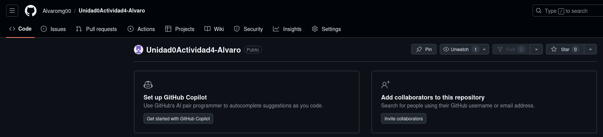

Y después con linea de comandos:

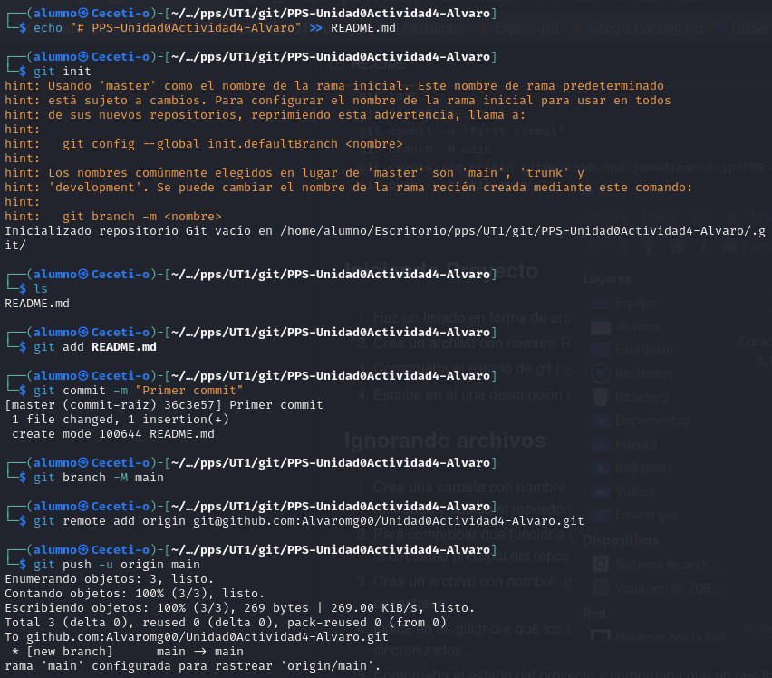

----

### Iniciando proyecto e ignorando archivos

Listamos los archivos del directorio con '*```tree -a```*'

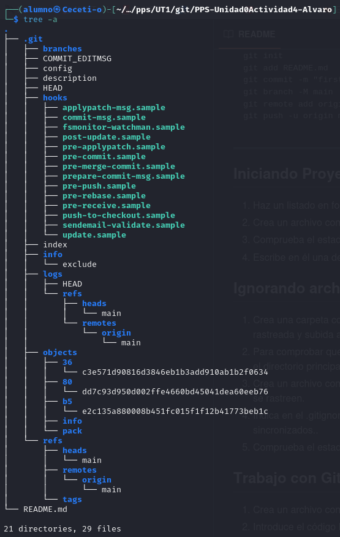

Ahora creo el archivo ```README.md``` y agrego una descripción:

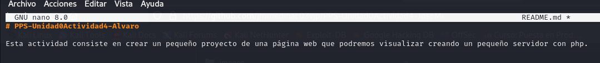

Ahora compruebo el estado con ```git status -s``` :

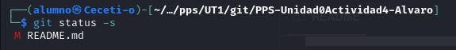

Veo que sale el archivo ```README.md``` modificado y en rojo porque no lo he añadido al *'staging area'*.

Ahora creo un directorio llamado Excluded para añadir en el todo lo que no sea necesario subir a Github, y creo un archivo vacio dentro, luego en el directorio principal del repositorio creo otro archivo llamado '```excluido.txt```' :

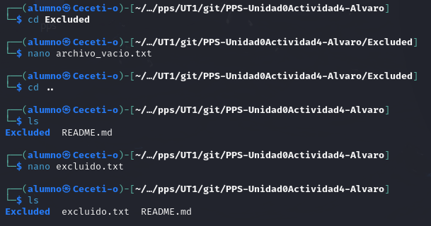

Creo el archivo ```.gitignore``` e incluyo en el todos los archivos con extension *.txt*, y el directorio ***Excluded*** que cree anteriormente:

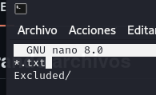

Entonces git ya no le dará seguimiento a esos archivos y directorio.

----

### Trabajo con Git

Vamos a crear un archivo llamado ***index.html*** con un 'Hola mundo' :

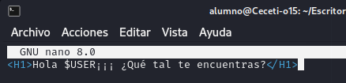

Ahora vemos el estado de git y nos indica que esta sin seguimiendo, nos indica que hagamos ```git add```, a si que lo hacemos, luego hacemos ```git commit -m``` y volvemos a comprobar el estado, para ver que ya no nos indica que esta sin seguimiento, y por último ```git push origin main``` :

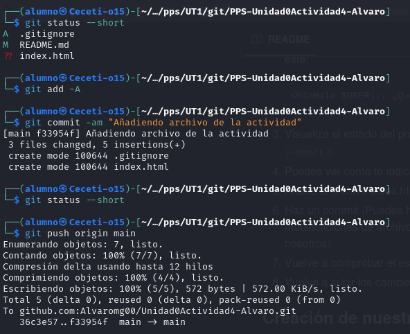

Ahora en otra pestaña del terminal ejecutamos ```php -S 0:8080``` para que cree un servidor con la página *index.html* creada anteriormente:

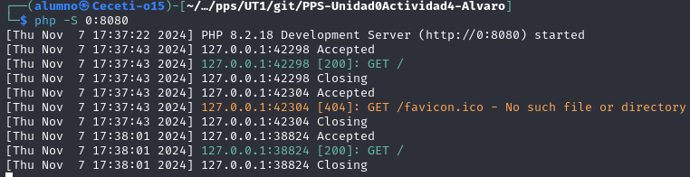

Ahora ya podemos ir al navegador y con el puerto *8080* podremos ver ejecutada nuestra pagina *index.html*:

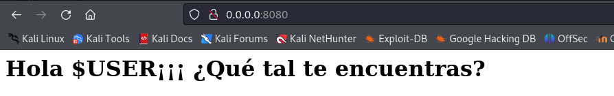

Me creo una copia del fichero *index.html* y le llamo *index.html.save*, y modifico el *index.html*:

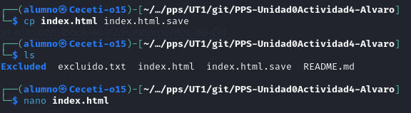


Ademas compruebo con ```git diff``` las diferencias:

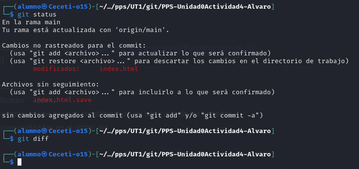

Ahora para ver la diferencia en el contenido solo hay que refrescar el navegador:

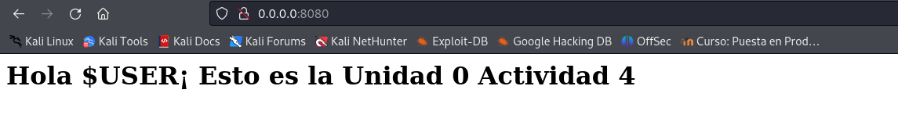

Utilizo git restore para volver al estado anterior del index.html:

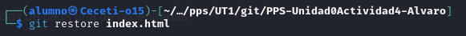

Vuelvo a refrescar el navegador para ver como ha vuelto a poner lo mismo de antes:

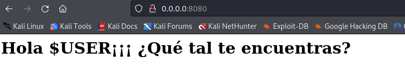

Y ahora sobreescribo index.html con el contenido de la copia y confirmo los cambios, ademas hago un commit y push al repositorio remoto, y si nos vamos a Github podremos comprobar como se han reflejado los cambios en el repositorio remoto:

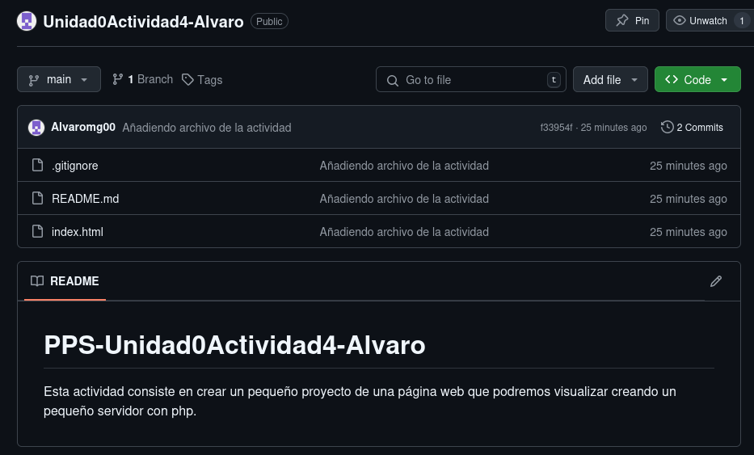

Modifico el archivo index.html desde Github y refresco el navegador:

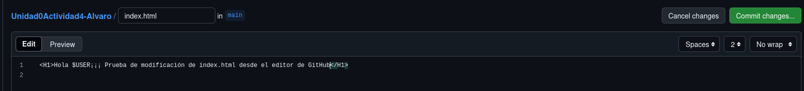

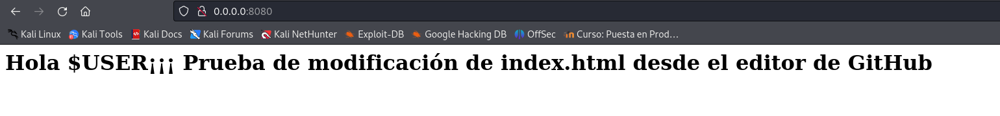

----

### Logs de Git

Ahora vamos a comprobar los logs:

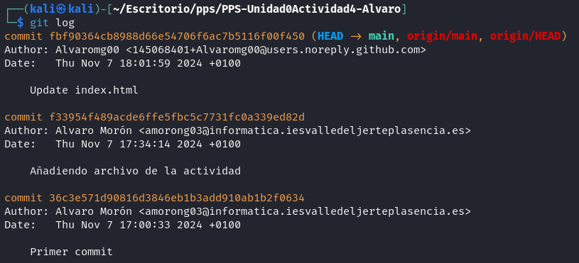

Le añadimos el modificador para que sean solo los últimos 3 commits:

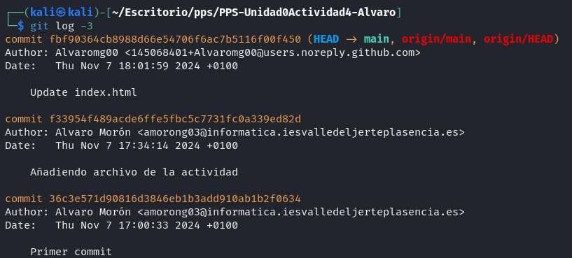

Ahora con el modificador ```--pretty=oneline``` para que se muestre en una sola linea:

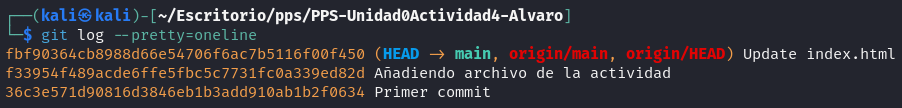

Ahora quiero que se vean las diferencias de los últimos 2 commits para ello utilizo ```git log -p -2```:

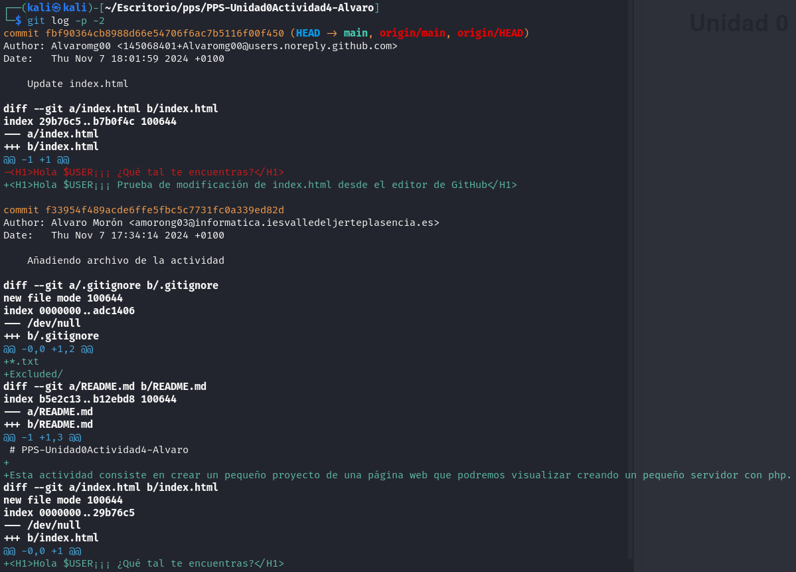

Ahora los logs del último día:

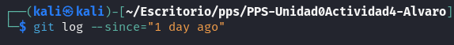

----

### Ramas

Primero vamos a listar las ramas existentes:

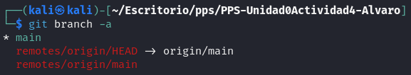

Ahora voy a crear una nueva rama llamada Vers1 con el contenido de la rama actual y me muevo directamente a ella:

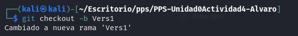

Y ya por último modifico el contenido de index.html, y hago un push a la rama Vers1, entonces si vamos a Github podemos comprobar que el index.html de la rama main es diferente al de la rama Vers1.