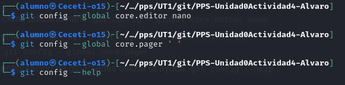
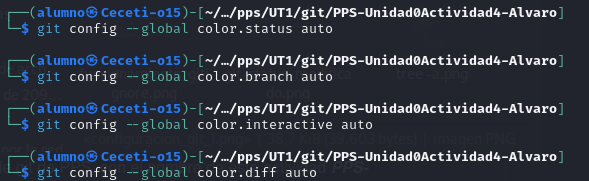

# Unidad 0 - Actividad 4 Uso de Git
----

## Indice

* [Configurando Git](#configurando-git)
* [Creación de proyecto y repositorio](#creacion-de-proyecto-y-repositorio)
* [Iniciando proyecto e ignorando archivos](#iniciando-proyecto-e-ignorando-archivos)
* [Trabajo con Git](#trabajo-con-git)
* [Logs de Git](#logs-de-git)
* [Ramas](#ramas)

----

### Configurando Git

Vamos a seguir configurando Git, en este ejercicio configuraremos: El **editor de comandos**, el **pager** para que nos muestre el contenido en vez de entrar al editor, el **color.status**, **color.branch**, **color.interactive** y **color.diff** :

----

### Creación de proyecto y repositorio

Lo primero es crear un nuevo repositorio público con el nombre de ***PPS-Unidad0Actividad4-Alvaro***

----

### Iniciando proyecto e ignorando archivos

----

### Trabajo con Git

----

### Logs de Git

----

### Ramas